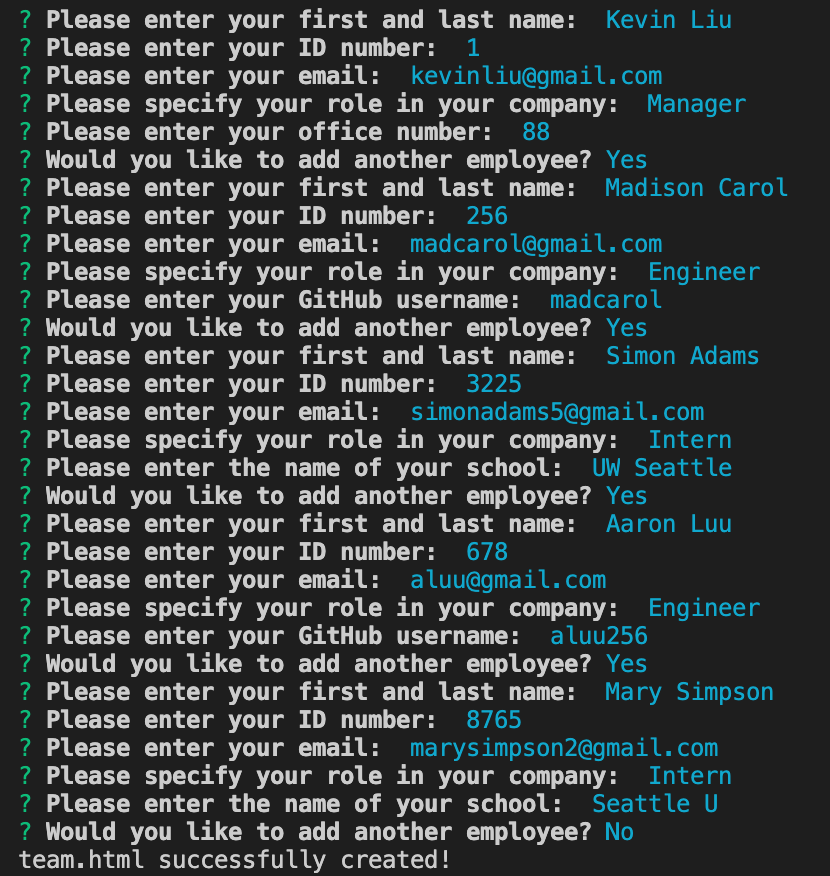

# employee-summary

  

## Table of Contents

* [Description](#description)

* [Installation](#installation)

* [Usage](#usage)

* [Tests](#tests)

* [Issues](#issues)

## Description

An application that allows the user to build a software engineering team profile by typing in necessary information. The user can create managers, employees and interns. 

The overall design of the project uses the following:

* JavaScript
* HTML and CSS
* Node

## Installation

Please clone the repository and run the following command after making sure you are in the 'Develop' folder:

```
node app.js
```

## Usage

When running the app, the user is first asked for the employee's first and last name. They are then asked for the employee's ID number. Depending on what the user chooses, they will be asked for the employee's office number (if the user selects 'Manager'), GitHub username ('Engineer') or school ('Intern'). The user can choose to add more employees if needed. Otherwise, an HTML page listing all employees will be generated for the user. Pictures of both the Terminal and the resulting webpage are displayed below:




## Tests

A Tests folder is included with the project.

## Issues

* Though a small input error, the app creates a comma after adding more than 3 employees next to the boxes where the employee information is stored.


